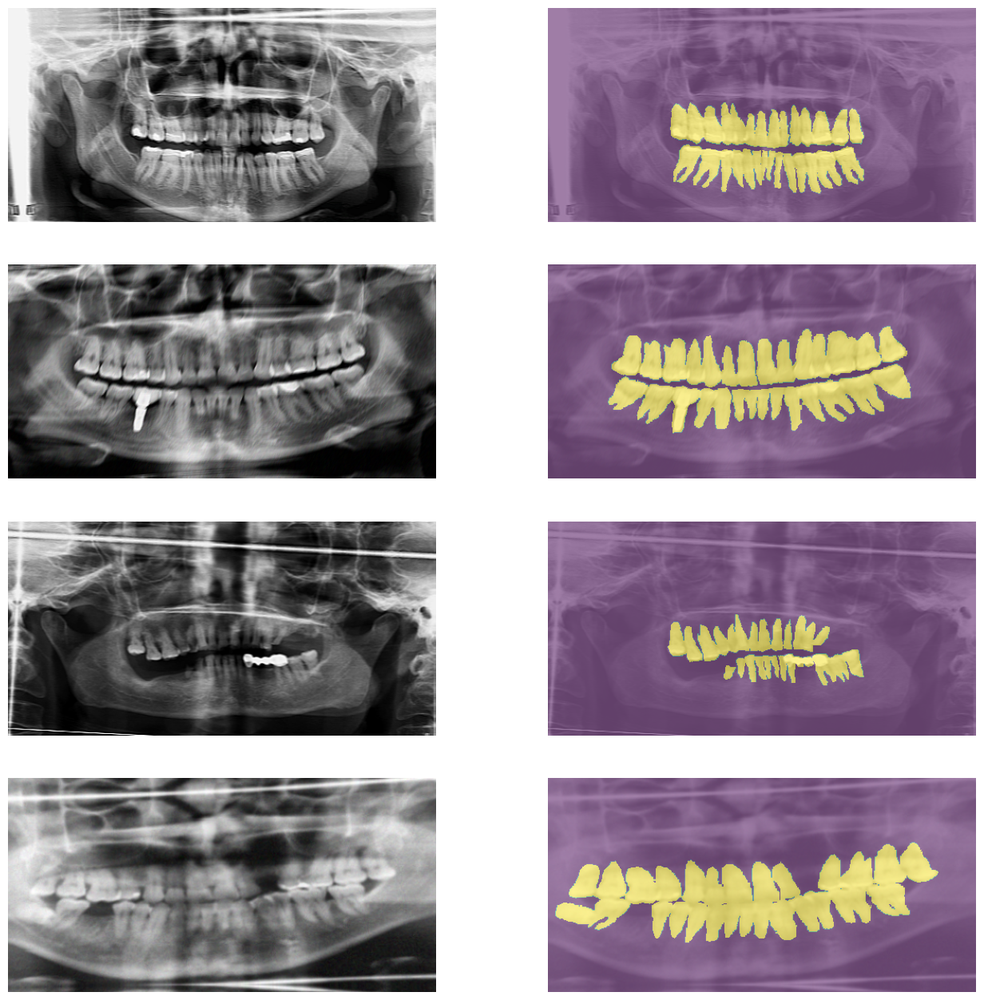
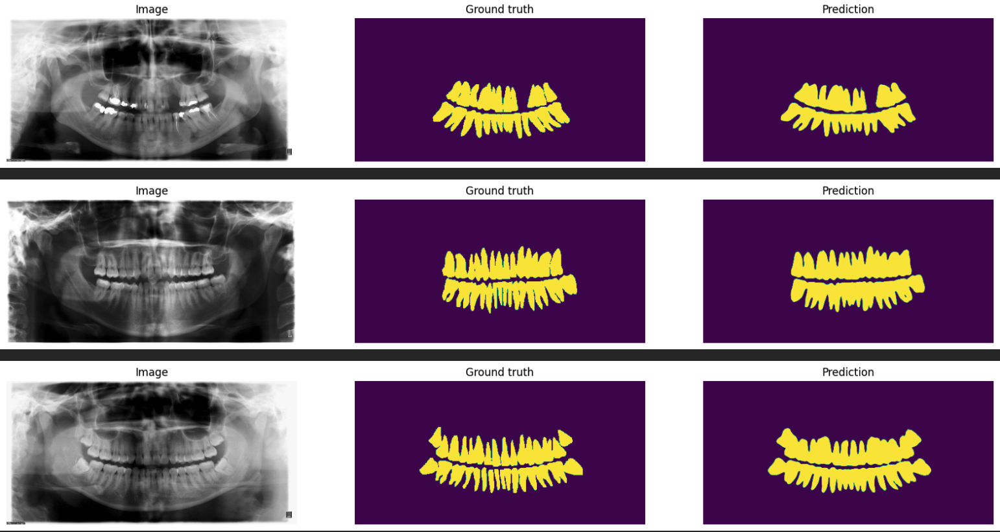
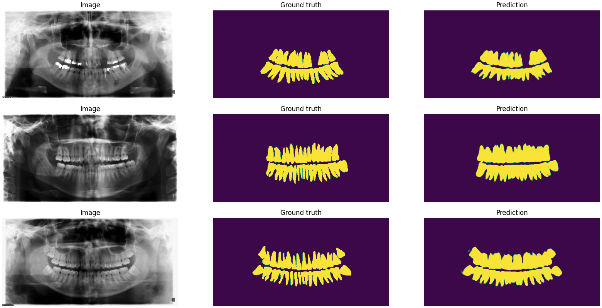

# Tuft Dental Database Segmentation Experiment

This repository contains experiments on the Tuft Dental Datasets using various state-of-the-art segmentation architectures. The goal is to compare the performance of different models in segmenting dental images.

## Table of Contents
- [Introduction](#introduction)
- [Dataset](#dataset)
- [Models](#models)
- [Backbones](#backbones)
- [Hyperparameters](#hyperparameters)
- [Criterion and Evaluation Metrics](#criterion-and-evaluation-metrics)
- [Test Results](#test-results)
- [Prediction Results](#prediction-results)
- [Installation](#installation)
- [Inference Usage](#inference-usage)
- [Run Tensorboard](#run-tensorboard)
- [Libraries](#libraries)

## Introduction
In this project, we delve into the fascinating world of dental image segmentation using a suite of advanced neural network architectures. Our models include U-Net, FPN, PAN, PSPNet, DeepLabV3, DeepLabV3+, and U-Net++, each paired with powerful yet efficient backbones like ResNet34 and MobileNetV2. 

The primary goal is to pinpoint the best-performing model that balances accuracy and computational efficiency. This balance is crucial for deploying these models on low- to medium-spec hardware, making advanced dental image analysis accessible and practical in various clinical settings. By leveraging lightweight backbones, we aim to achieve high-quality segmentation without the need for high-end infrastructure, thus broadening the scope of these technologies' applicability.

## Dataset
The **Tuft Dental Database** is a valuable resource for dental diagnostics, featuring panoramic X-ray images that offer a comprehensive view of the upper and lower jaws. These images capture detailed structures including teeth, jawbones, and surrounding areas, making them essential for identifying issues like impacted teeth, jaw disorders, and assessing overall dental health. The dataset is meticulously annotated to support the development and evaluation of advanced segmentation models.

### Dataset Split
- **Training Set**: 700 images
- **Validation Set**: 150 images
- **Test Set**: 150 images

To enhance the robustness of our dataset, we applied a variety of transformations from the Albumentations library. These augmentations are meticulously executed to maintain the intricate details and integrity of the original images, ensuring high-quality data for both model training and testing. The key transformations include:

- **Geometric Transformations:** These include random rotations, translations, scaling, and keypoint transformations to simulate different viewpoints and image perspectives.
- **Color and Contrast Adjustments:** Adjustments to brightness, contrast, saturation, and hue to account for varying lighting conditions and improve the model's ability to generalize.
- **Blur and Noise:** Introduction of Gaussian blur, motion blur, and noise to make the model robust to different types of image artifacts.
- **Distortions:** Application of elastic transformations, grid distortions, and optical distortions to mimic real-world deformations and enhance the model's adaptability.
- **Flips:** Horizontal flips to provide the model with a diverse set of orientations.
- **Other Effects:** Additional effects such as CLAHE (Contrast Limited Adaptive Histogram Equalization), sharpen, emboss, blur, and gamma correction to further diversify the training data and enhance feature extraction.

These augmentations are carefully applied to preserve the detailed information within the images, ensuring the augmented dataset remains a valuable resource for effective model training and testing.


## Models
The following segmentation architectures are implemented and compared:
- **U-Net**: 
  - **Paper**: [U-Net: Convolutional Networks for Biomedical Image Segmentation](https://arxiv.org/abs/1505.04597)
  - **Description**: A convolutional network architecture for fast and precise segmentation of images. It uses a U-shaped architecture with skip connections for accurate localization and context capture.

- **FPN (Feature Pyramid Networks)**: 
  - **Paper**: [Feature Pyramid Networks for Object Detection](https://arxiv.org/abs/1612.03144)
  - **Description**: A feature pyramid network for building high-level feature maps at different scales. It enhances the capability of the network to detect objects at various scales.

- **PAN (Pyramid Attention Network)**: 
  - **Paper**: [Pyramid Attention Network for Semantic Segmentation](https://arxiv.org/abs/1805.10180)
  - **Description**: A network that enhances feature representation by integrating local and global context information through pyramid attention modules, improving semantic segmentation accuracy.

- **PSPNet (Pyramid Scene Parsing Network)**: 
  - **Paper**: [Pyramid Scene Parsing Network](https://arxiv.org/abs/1612.01105)
  - **Description**: Utilizes pyramid parsing modules to aggregate context information. It captures global context information to improve pixel-level segmentation.

- **DeepLabV3**: 
  - **Paper**: [Rethinking Atrous Convolution for Semantic Image Segmentation](https://arxiv.org/abs/1706.05587)
  - **Description**: Employs atrous convolutions for multi-scale context aggregation. It allows for dense feature extraction without losing resolution.

- **DeepLabV3+**: 
  - **Paper**: [Encoder-Decoder with Atrous Separable Convolution for Semantic Image Segmentation](https://arxiv.org/abs/1802.02611)
  - **Description**: An extension of DeepLabV3 that includes an encoder-decoder structure for better performance. It combines the benefits of spatial pyramid pooling and encoder-decoder architectures.

- **U-Net++**: 
  - **Paper**: [UNet++: A Nested U-Net Architecture for Medical Image Segmentation](https://arxiv.org/abs/1807.10165)
  - **Description**: A nested U-Net architecture designed for more precise segmentation. It introduces dense skip connections for better feature fusion.

## Backbones
The following backbones are used for feature extraction in some of the models:
- **ResNet34**: 
  - **Paper**: [Deep Residual Learning for Image Recognition](https://arxiv.org/abs/1512.03385)
  - **Description**: ResNet34 is a 34-layer residual network that uses skip connections to jump over some layers, helping to mitigate the vanishing gradient problem. This architecture allows for training very deep networks, enabling significant performance improvements on various benchmarks. ResNet34 is known for its simplicity and scalability.

- **MobileNetV2**: 
  - **Paper**: [MobileNetV2: Inverted Residuals and Linear Bottlenecks](https://arxiv.org/abs/1801.04381)
  - **Description**: MobileNetV2 is designed for mobile and embedded vision applications, focusing on computational efficiency and low memory usage. It introduces inverted residuals, where the input and output are thin bottleneck layers, and linear bottlenecks to maintain a rich feature representation. MobileNetV2 provides a good balance between accuracy and efficiency.

## Hyperparameters

The following hyperparameters are used for training the models:

- **Input Size**: 256 x 512
- **Batch Size**: 32
- **Optimizer**: Adam
- **Learning Rate**: 1e-3
- **Scheduler**: Reduce On Plateau
  - **Factor**: 0.5
  - **Patience**: 5
- **Early Stopping**: Patience 20


## Criterion and Evaluation Metrics
### Criterion
We use `DiceLoss` as the loss function during training to improve the model's performance on segmentation tasks.
### Evaluation Metrics

The performance of each model is evaluated using the following metrics:
- Dice Coefficient: Measures the overlap between the predicted segmentation and the ground truth. It is particularly useful for imbalanced datasets.
- Pixel Accuracy: Computes the percentage of correctly classified pixels in the entire image.
- IoU (Intersection over Union): Measures the intersection between the predicted segmentation and the ground truth divided by their union, providing a robust evaluation of segmentation performance.

### Model Performance Summary

This table summarizes the performance metrics (Dice Coefficient, IoU, Pixel Accuracy, and Relative Time) on the **validation set** for various models with ResNet34 and MobilenetV2 backbones. 
The models are ranked based on the average of Dice Coefficient, IoU, and Pixel Accuracy.

| Rank | Architecture | Encoder     | Dice Coefficient | IoU Value | Pixel Accuracy | Average | Relative |
|------|--------------|-------------|------------------|-----------|----------------|---------|----------|
| 1    | U-Net++      | ResNet34    | 0.9124           | 0.8401    | 0.9791         | 0.9105  | 55m 33s  |
| 2    | U-Net        | ResNet34    | 0.9078           | 0.8322    | 0.9778         | 0.9059  | 25m 0s   |
| 3    | U-Net        | MobilenetV2 | 0.9065           | 0.8296    | 0.9774         | 0.9045  | 31m 38s  |
| 4    | U-Net++      | MobilenetV2 | 0.9045           | 0.8268    | 0.977          | 0.9028  | 35m 51s  |
| 5    | DeepLabV3+   | ResNet34    | 0.9056           | 0.8287    | 0.9773         | 0.9039  | 25m 26s  |
| 6    | PAN          | ResNet34    | 0.9056           | 0.8303    | 0.9776         | 0.9045  | 27m 15s  |
| 7    | DeepLabV3+   | MobilenetV2 | 0.898            | 0.8166    | 0.9756         | 0.8967  | 40m 18s  |
| 8    | FPN          | MobilenetV2 | 0.8951           | 0.812     | 0.9748         | 0.8939  | 35m 18s  |
| 9    | PAN          | MobilenetV2 | 0.8912           | 0.8069    | 0.9742         | 0.8908  | 31m 57s  |
| 10   | DeepLabV3    | ResNet34    | 0.8962           | 0.8134    | 0.9748         | 0.8948  | 44m 56s  |
| 11   | DeepLabV3    | MobilenetV2 | 0.8808           | 0.7884    | 0.9709         | 0.8800  | 43m 17s  |
| 12   | PSPNet       | ResNet34    | 0.89             | 0.8031    | 0.9732         | 0.8888  | 26m 37s  |
| 13   | FPN          | ResNet34    | 0.8877           | 0.8006    | 0.9731         | 0.8871  | 28m 30s  |
| 14   | PSPNet       | MobilenetV2 | 0.8797           | 0.7866    | 0.9706         | 0.8790  | 34m 46s  |


## Test Results
This table summarizes the performance metrics (Dice Coefficient, IoU, Pixel Accuracy, and Inference Time) on the **test set** for various models with ResNet34 and MobilenetV2 backbones.
The rank is based on the average of the test dice, test IoU, and test accuracy metrics.

| Rank | Architecture  | Encoder        | Test Dice   | Test IoU    | Test Accuracy | Inference Time (s) |
|------|---------------|----------------|-------------|-------------|---------------|--------------------|
| 1    | UNetPlusPlus  | ResNet34       | 0.9115      | 0.8387      | 0.9793        | 0.0280             |
| 2    | UNet          | ResNet34       | 0.9048      | 0.8273      | 0.9778        | 0.0111             |
| 3    | DeepLabV3Plus | ResNet34       | 0.9028      | 0.8242      | 0.9773        | 0.0224             |
| 4    | UNetPlusPlus  | MobileNetV2    | 0.9026      | 0.8236      | 0.9771        | 0.0309             |
| 5    | DeepLabV3Plus | MobileNetV2    | 0.8945      | 0.8111      | 0.9753        | 0.0213             |
| 6    | FPN           | MobileNetV2    | 0.8922      | 0.8074      | 0.9747        | 0.0174             |
| 7    | DeepLabV3     | ResNet34       | 0.8933      | 0.8088      | 0.9747        | 0.0671             |
| 8    | PAN           | ResNet34       | 0.9031      | 0.8263      | 0.9775        | 0.0656             |
| 9    | UNet          | MobileNetV2    | 0.9036      | 0.8247      | 0.9772        | 0.0594             |
| 10   | FPN           | ResNet34       | 0.8835      | 0.7940      | 0.9728        | 0.0379             |
| 11   | PSPNet        | ResNet34       | 0.8866      | 0.7976      | 0.9730        | 0.0213             |
| 12   | PAN           | MobileNetV2    | 0.8884      | 0.8026      | 0.9742        | 0.0209             |
| 13   | DeepLabV3     | MobileNetV2    | 0.8768      | 0.7821      | 0.9705        | 0.0564             |
| 14   | PSPNet        | MobileNetV2    | 0.8760      | 0.7805      | 0.9705        | 0.0182             |

The rank is based on the inference time, faster models are ranked higher

| Rank | Architecture  | Encoder        | Test Dice   | Test IoU    | Test Accuracy | Inference Time (s) |
|------|---------------|----------------|-------------|-------------|---------------|--------------------|
| 1    | FPN           | MobileNetV2    | 0.8922      | 0.8074      | 0.9747        | 0.0174             |
| 2    | PSPNet        | MobileNetV2    | 0.8760      | 0.7805      | 0.9705        | 0.0182             |
| 3    | PAN           | MobileNetV2    | 0.8884      | 0.8026      | 0.9742        | 0.0209             |
| 4    | DeepLabV3Plus | MobileNetV2    | 0.8945      | 0.8111      | 0.9753        | 0.0213             |
| 5    | PSPNet        | ResNet34       | 0.8866      | 0.7976      | 0.9730        | 0.0213             |
| 6    | DeepLabV3Plus | ResNet34       | 0.9028      | 0.8242      | 0.9773        | 0.0224             |
| 7    | UNet          | ResNet34       | 0.9048      | 0.8273      | 0.9778        | 0.0111             |
| 8    | UNetPlusPlus  | ResNet34       | 0.9115      | 0.8387      | 0.9793        | 0.0280             |
| 9    | UNetPlusPlus  | MobileNetV2    | 0.9026      | 0.8236      | 0.9771        | 0.0309             |
| 10   | FPN           | ResNet34       | 0.8835      | 0.7940      | 0.9728        | 0.0379             |
| 11   | UNet          | MobileNetV2    | 0.9036      | 0.8247      | 0.9772        | 0.0594             |
| 12   | DeepLabV3     | MobileNetV2    | 0.8768      | 0.7821      | 0.9705        | 0.0564             |
| 13   | PAN           | ResNet34       | 0.9031      | 0.8263      | 0.9775        | 0.0656             |
| 14   | DeepLabV3     | ResNet34       | 0.8933      | 0.8088      | 0.9747        | 0.0671             |

### Recommended Model Based on Average Metrics:
**Model: UNetPlusPlus with ResNet34**

*Reason:*

Highest average performance across Test Dice (0.9115), Test IoU (0.8387), and Test Accuracy (0.9793).
Ranked 1st based on average metrics.


### Recommended Model Based on Inference Time:
**Model: FPN with MobileNetV2**

*Reason:*

Fastest inference time (0.0174 seconds).
Still has good performance with Test Dice (0.8922), Test IoU (0.8074), and Test Accuracy (0.9747).
Ranked 1st based on inference time.

## Prediction Results

- **UNet++ with ResNet34**

*This section highlights the performance of the UNet++ model with ResNet34 on the test dataset. Below, you can observe the original image, the ground truth mask, and the model's prediction, demonstrating its effectiveness in capturing details.*




- **FPN with MobileNetV2**

*Here we present the performance of the FPN model with MobileNetV2. Despite its quick inference time, this model maintains commendable accuracy. Below are the original image, the ground truth mask, and the model's prediction, illustrating its capabilities.*



## Installation
Clone the repository and install the required dependencies:
```bash
git clone https://github.com/siapai/tuft-dental-segmentation.git
cd tuft-dental-segmentation
pip install -r requirements.txt
```

## Inference Usage
### Using Pytorch Model
[>> Download Pytorch Model <<](https://drive.google.com/file/d/1-hoRpjWgs14i_HqItV_fapQVwiq_HkFE/view?usp=drive_link)

[See Inference.ipynb](Inference.ipynb)

*see Inference.ipynb*
```angular2html
from training import DentalModel

...

# Load pytorch model
arch = "unetplusplus"
encoder_name = "resnet34"
path = "tensorboards/unetplusplus-resnet34/version_0/checkpoints/best_checkpoint.ckpt"
model = DentalModel.load_from_checkpoint(path, arch=arch, encoder_name=encoder_name, in_channels=3, out_classes=1)

model.to(device)

# Run inference
model.eval()
with torch.inference_mode():
    output = model(augmented.to(device))
    output = torch.sigmoid(output)
    output = output.squeeze().cpu().numpy()

...


### Using Onnx Model
```
[>> Download Onnx Model <<](https://drive.google.com/file/d/10varVO19sgIlGb07OkZA4mk8fB5JY4yi/view?usp=sharing)

[See Inference_Onnx.ipynb](Inference_Onnx.ipynb)
```
import onnxruntime as ort

...

# Load the ONNX model
onnx_model_path = "upp_resnet_model.onnx"
ort_session = ort.InferenceSession(onnx_model_path)

# Run inference
ort_inputs = {'input': target}
ort_outs = ort_session.run(None, ort_inputs)
output = ort_outs[0]

...

```


## Run Tensorboard

Here’s how you can enhance the process by running TensorBoard to explore experiment results
```
 tensorboard --logdir=tensorboards
```
## Libraries

The following libraries are utilized in this project to ensure efficient and effective processing and modeling of the dataset:

- **Torch**: `2.3.0`
  - The core library for building and training neural networks in PyTorch.

- **Torchvision**: `0.18.0`
  - A package containing popular datasets, model architectures, and common image transformations for computer vision tasks.

- **Albumentations**: `1.4.8`
  - Used for advanced data augmentation techniques to enhance the robustness of the model without losing important details in the images.

- **PyTorch Lightning**: `2.2.5`
  - Provides a high-level framework for organizing and managing PyTorch code, enabling easier experimentation and model training.

- **Torchmetrics**: `1.4.0`
  - Offers a wide range of metrics for evaluating machine learning models in PyTorch, facilitating consistent and comprehensive performance assessment.

- **TensorBoard**: `2.16.2`
  - A tool for visualizing and monitoring the training process, providing insights into model performance and helping with debugging and optimization.


