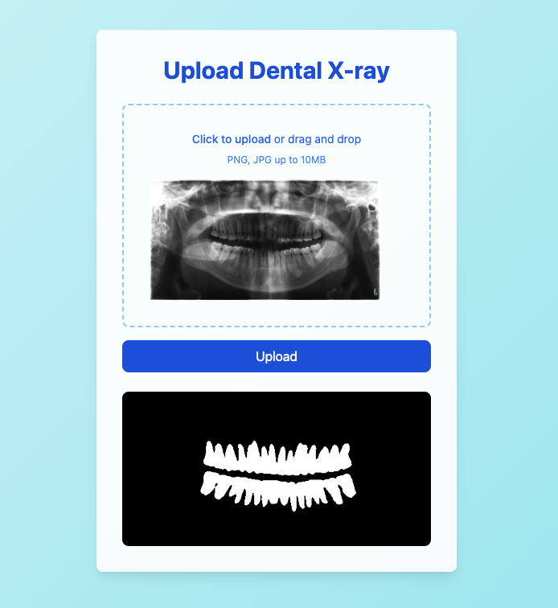

# FastAPI Dental X-ray Upload

This project provides a FastAPI application for uploading and predicting dental X-ray images. The application includes a modern UI with a drag-and-drop feature for image uploads.

## Requirements

- Docker

## Setup

### 1. Build the Docker Image

```sh
docker build -t fastapi-dental-xray .
```

### 2. Run the Docker Container
Use the following command to run the Docker container:
```shell
docker run -d -p 8000:8000 fastapi-dental-xray
```
### 3. Access the Application
```shell
## Web prediction
http://localhost:8000

## Api Docs
http://localhost:8000/docs
```

**Web Preview**

